# Lab 1: Provisioning the Docker Enterprise Platform in Azure

There are a variety of methods of instantiating a Docker Enterprise cluster, from manual setup to the Azure Marketplace. 

This lab uses the Docker Certified Infrastructure (DCI) project to first provision and then configure all necessary Azure resources for a highly-available Docker Enterprise environment. 

> The cluster that is provisioned via the Azure Marketplace template is will soon be superceded and replaced with a new template based on the DCI scripts

## Pre-Requisites

- Laptop / Development VM
    
- Azure Subscription

## Exercises

### Exercise 1 - Create a Docker ID

Docker Enterprise customers purchase a subscription, which is then used as part of the Docker Enterprise Engine installation, and to determine available featuEers in both Universal Control Plane (UCP), and Docker Trusted Registry (DTR). Subscriptions are linked to a [Docker ID](https://docs.docker.com/docker-id/), which is an account used across the various Docker products and services. If you have ever created an account on the [Docker Hub](https://hub.docker.com/) or downloaded [Docker for Windows](https://docs.docker.com/docker-for-windows/install/) then you already have a Docker ID. While Hub is the location to find community content, paid customers administer their subscriptions via the [Docker Store](https://store.docker.com)

> If you already have a Docker ID please skip ahead to Exercise 2

To create a Docker ID:

1. Open a browser and navigate to the [Sign Up](https://store.docker.com/signup) page on the Docker Store.

1. Select a username and password, while providing an email account. Then complete the reCaptcha and click the **Sign Up** button

    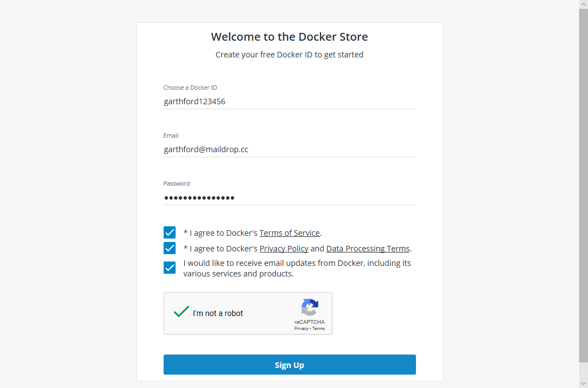

1. In your email, open the confirmation email and click the link to finalize account setup. Congratulations! You are now the proud owner of a Docker ID.

    > The confirmation email take up to 5 minutes to receive, depending on if the server had its coffee that morning

Once finalizing your new account, you should be asked to login. If not, navigate back to the [Docker Store](https://store.docker.com) and sign in via the link in top right-hand corner.

### Exercise 2 - Procure a License

1. At the [Docker Store](https://store.docker.com) select **Docker EE** from the navigation bar and click the following **[Get Docker EE](https://store.docker.com/search?offering=enterprise&type=edition)** button

    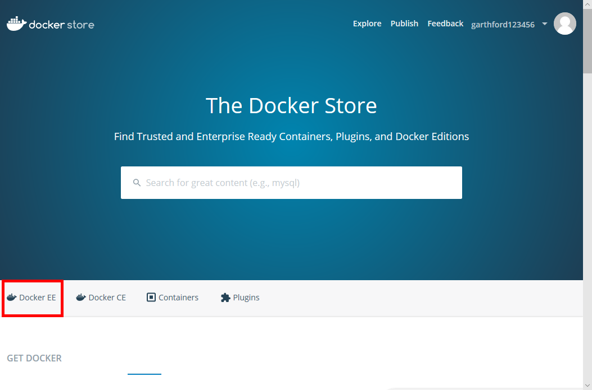

1. Docker Enterprise can install on [a wide variety](https://success.docker.com/article/compatibility-matrix) of operating systems. Since UCP and DTR are implemented as Linux Containers, we need Linux servers to serve those applications.

    For today's exercise let's stick with Ubuntu. Select **Docker Enterprise for Ubuntu**

    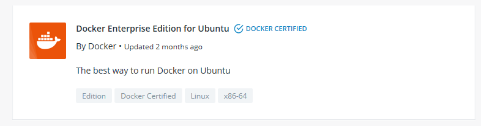

    > Note: Please do not select **Docker Enterprise for Azure**. This links to the Azure Marketplace, which will soon be updated with the DCI scripts that we will use today

1. Docker offers a free trial period for users to test and experience the platform before purchasing. Click the **Start 1 Month Trial** button to begin the process.

    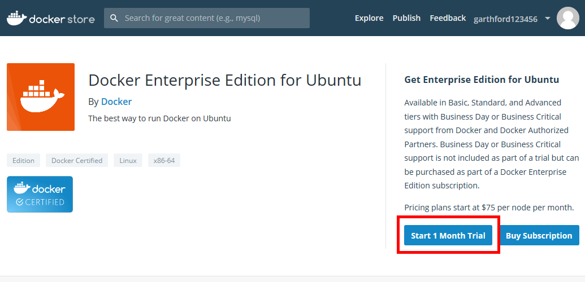

1. Complete the sign up form and click the **Start your evaluation!** button.

1. The resuling "Setup Instructions" screen contains a variety of information regarding your new trial license:

    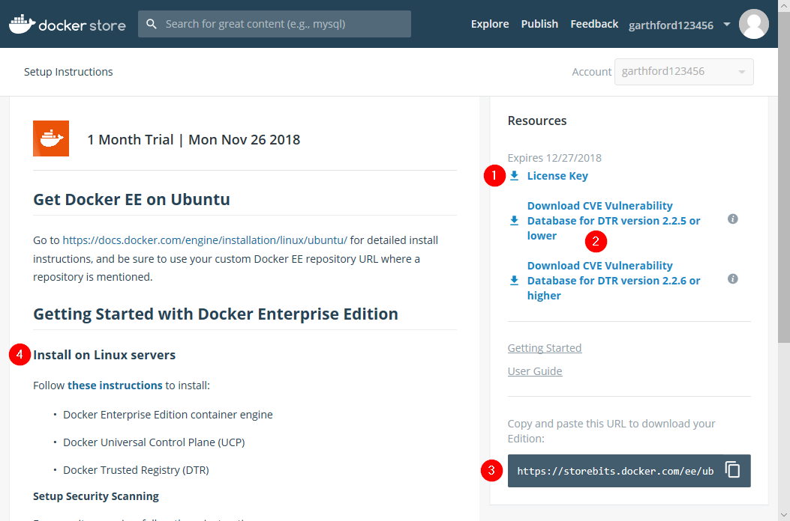

    1. The **License Key** link is used to download a license file that is used by Docker Enterprise. 

    2. Docker Trusted Registry (DTR) provides an out of the box capability to [deeply scan Docker images for vulnerabilities](https://docs.docker.com/ee/dtr/admin/configure/set-up-vulnerability-scans/). Typically the database for these vulnerabilities is updated automatically over the internet, but for air-gapped environments users can download `.tar` files for manual application to their DTR installations.  

    3. The provided URL is specific to your subscription, and is used to install the Docker Enterprise Engine repository via common Linux package mangement systems. 

    4. Manual installation instructions are available for users not using the Docker Certified Infrastructure (DCI) scripts.

You have now activated a free, 30-day trial subscription to Docker Enterprise. This license can be used to provision and operate a cluster regardless of infrastructure - in Azure's public datacenters, Azure's sovereign clouds, on-premises on Azure Stack, or other infrastructure approach. 

### Exercise 3 - Provision a Docker Enterprise Cluster in Azure

Docker Certified Infrastructure is made up of 3 components: 

1. Detailed **Reference Architectures** that are specific to each infrastructure provider, such as [Azure](https://success.docker.com/article/certified-infrastructures-azure), that provide more granular detail than our [generalized reference architecture](https://success.docker.com/article/docker-ee-best-practices)

1. A series of **Solution Briefs** that deep dive into integrating a specific technology into a Docker Enterprise cluster. For example, using [Azure Premium Storage](https://success.docker.com/article/azure-premium-storage). 

1. **Automation scripts** using Terraform to provision all necessary Azure resources, and Ansible to handle installation and configuration of the cluster. Note that these scripts are temporarily removed from the website while being refreshed. Instead, an archive is available in this repository.

The automation scripts utilize a variety of libraries and tools:

- [Terraform](https://www.terraform.io/) is a platform agnostic tool for provisioning infrastructure and is roughly analogous to using Azure Resource Manager (ARM)

- [Ansible](https://www.ansible.com/) is a configuration management and automation tool to quickly execute repetative tasks and is roughly analogous to Desired State Configuration (DSC)

 - [Diver](https://github.com/joeabbey/diver) - is a small Golang wrapper around the various Docker Enterprise APIs that is used to make CLI calls from a terminal environment

 - [Azure Service Principal](https://docs.microsoft.com/en-us/azure/active-directory/develop/app-objects-and-service-principals) - the automation scripts utilize a SP with granted permissions to programmatically interact with Azure resources within a given subscription

While these pre-requisistes may be installed manually, today we will use a Docker container that provides all necessary tools. To run this container we need to install Docker for Windows or Docker for Mac.

#### Install Docker for Windows/Mac

Docker distributes development tooling for various operating systems, including Windows and Mac. This tooling installs the Docker Engine, allowing a user to create and deploy containerized applications. 

1. Download the installer for your operating system:

    - [Windows](https://store.docker.com/editions/community/docker-ce-desktop-windows)

    - [Mac](https://store.docker.com/editions/community/docker-ce-desktop-mac)

1. Run the installer

1. Verify your machine is functioning properly by running

    ```sh
    docker run hello-world
    ```

1. If you are running Docker for Windows, toggle the environment to use Linux Containers by right-clicking on the tray icon and selecting "Linux Containers". 

    

    > This is done because the DCI installer container is implemented as a Linux Container, which requires a Linux environment to operate

#### Create an Azure Service Principal

Next, we will create a Service Principal for Terraform and Ansible to use when interacting with the Azure Subscription.

1. Open the [Azure Portal](https://portal.azure.com) and log into your subscription

1. In the top left corner select **All Services**, search for and then click on "Azure Active Directory" to open the AzureAD blade. 

    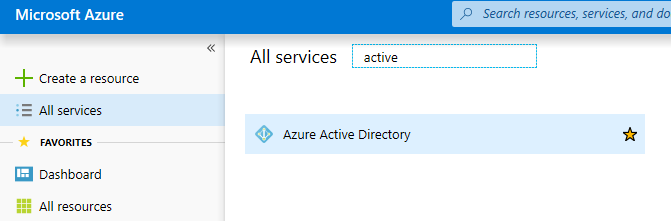

1. On the AD blade's left-hand navigation select **App Registrations** and then **New Application Registration**

    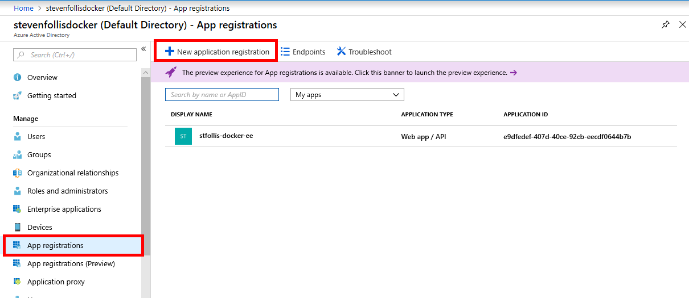

1. Enter a name for the AD Application (ex. `stfollis-docker-ee`), keep the default of **Web app / API**, enter a filler URL of **http://localhost** and click the **Create** button.  

1. In ther **Overview** tab of the new AD Application,  

 

1. On the Registered App blade, jot down the **Application ID** for later.

    Then, select **Settings**, and **Keys**. Click into the a new row in the **Passwords** section, set an expiration date, and click **Save**. Copy down the Client Secret for later

   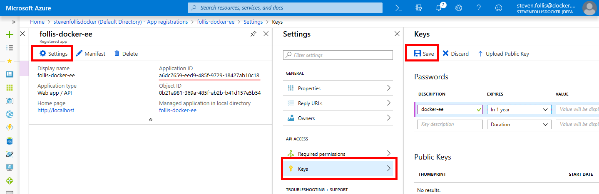

   > This is your one opportunity to keep that secret

1. As a last step we will create an Azure Resource Group and assign Contributor permissions for our AD Application. 

    Click **Create a Resource** in the top left corner and create a Resource Group. 

    On the new Resource Group's blade, select **Access control (IAM)** from the left-hand navigation. Then click **Add**, set role to **Contributor** and select the name of the freshly created AD Service Principal

    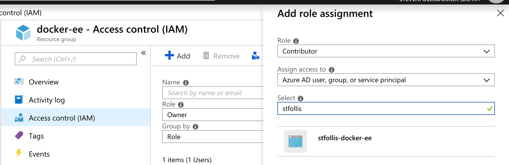

We now have a service account with permissions for a specific Resource Group. We will take those app values and add them as parameters in our automation scripts. 

> This Azure Service Principal is also used by Docker Enterprise to enable Kubernetes features in the Azure Subscription. LoadBalancer Services, Persistent Volume Claims, etc. will be created as needed with the same credential

#### Configure Docker Certified Infrastructure

In the folder for this lab is a directory called **dci**. Open it in your favorite text editor. These files contain all of the Terraform and Ansible scripts necessary to provision a production-grade, highly available Docker Enterprise cluster. First we will set some parameters, and then we will fire off the scripts. 

1. Open **terraform.tfvars**. This is the singular file that we will use to configure our deployment. 

1. Note that the Topology is configured to 3 UCP managers, 3 DTR workers, 2 Linux workers, and 2 Windows workers. This is our standard reference architecture to provide high availability. Any one of the managers can fail, and the remaining 2 will elect a new cluster leader and continue operations while the failed manager is restored. 

1. Set `deployment = "docker-ee"` to the name of your Resource Group. This is how DCI knows where to deploy resources, and needs to match where the SP has permissions to deploy those resources.

1. Set `docker_ee_subscriptions_ubuntu` equal to the GUID of your trial subscription. 

    Retrieve this value by returning in the browser to the [Docker Store](https://store.docker.com) and login. Then click your username in the top right and select **My Content** from the dropdown. Select your subscription, and in the subscription details page grab just the GUID fro the URL in the right-hand panel. For example, the URL `https://storebits.docker.com/ee/ubuntu/sub-14903d9e-e2bc-42f9-97cb-90ba72ce87be` would result in a GUID of `14903d9e-e2bc-42f9-97cb-90ba72ce87be`. 

1. The Docker License file is used by DCI, so while still in the Docker Store click **License Key** to download the file. Then, place it in the root of the `/dci` folder, as a peer to the `terraform.tfvars` file.

    This file is referenced by `docker_ucp_license_path   = "./docker_subscription.lic"`

    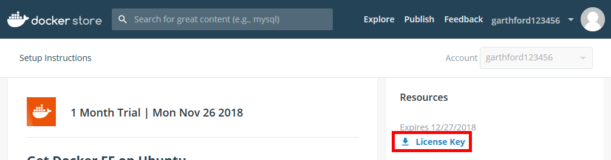

1. If your machine already has an SSH key generated, set its location with `ssh_private_key_path = "~/.ssh/id_rsa"`

    Otherwise, in your bash shell execute `ssh-keygen` with default options and no passphrase. A key will be generated for you, which you can verify with `cat ~/.ssh/id_rsa` on the same

    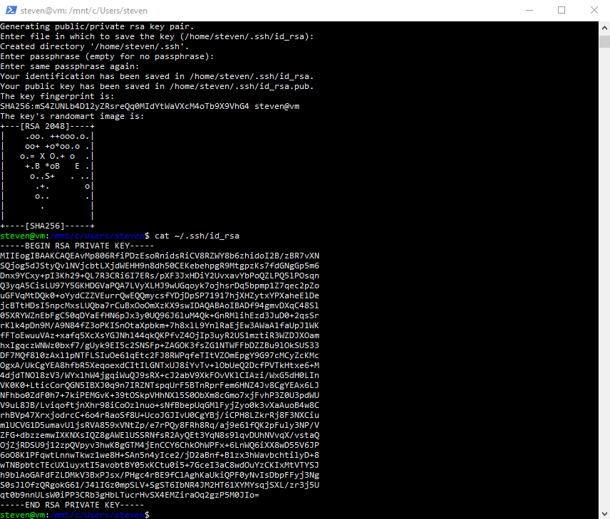

1. The `Azure Credentials` section is where we set the values from our Azure AD Application. The `client_id`, `client_id`, and `tenant_id` were all visible in the AD Application's blad, and `subscription_id` is available in the Subscriptions section of the Azure Portal

With the values customized to your subscription settings we are all set to deploy.

#### Run Docker Certified Infrastructure

Once the pre-requisites are handled we are now ready to execute DCI. First we will use Terraform to provision the resources, and then we will execute Ansible to configure those resources

1. Start ansible by first opening a bash shell and navigating to the `/dci` directory, and then executing:

    ```sh
    # Initialize the Terraform modules
    terraform init

    # Kick the tires and light the fires
    terraform apply
    ```


## Wrap-Up